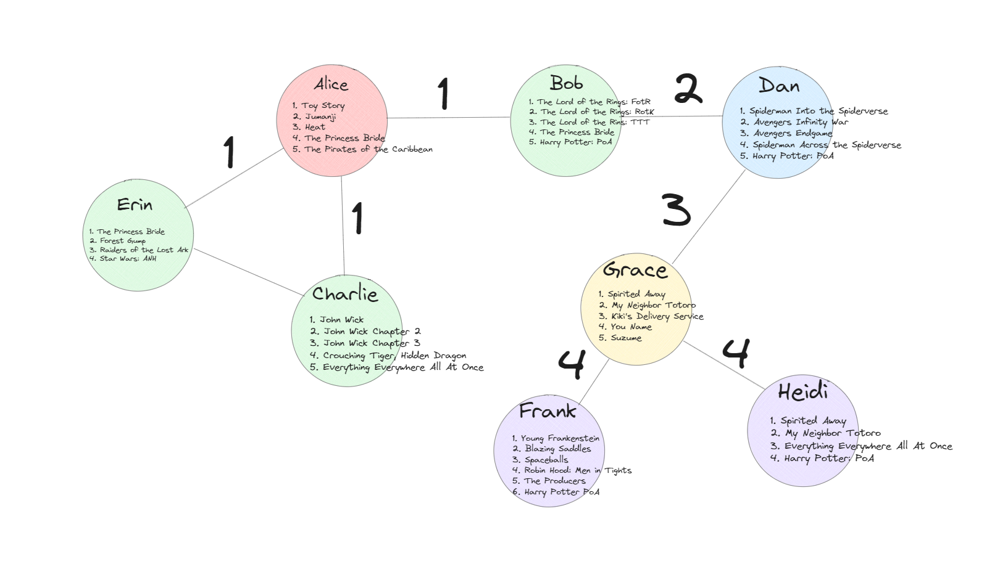

# Siren Technical Interview Coding Assignment

## Problem

- On your Facebook account, you have friends who all have a list of movies that they like. Write a function that returns the most popular movie of a person in his/her network of friends. Network means that you have to consider friends of friends as well.

## Understanding the Problem

- The first step we should take is to make sure we fully understand the problem we are trying to solve.
- Each Facebook user has a list of friends and a list of favorite movies.
- Their network of friends includes friends of friends, and we want to find the movie that occurs most often among all the favorite movie lists in the network.
- There is the idea that everyone is connected to each other by [six degrees of separation](https://en.wikipedia.org/wiki/Six_degrees_of_separation), and following that logic, we would potentially check all the users' movies list.
- So we have two options:
  1. Search all friends of friends
  2. Search friends of friends that are n degrees away from the current user

## Approach

- First let's look at the case where we search the entire friend network.
- We will need to visit each user in the network and track which movies are their favorites.
- The network can be described using an undirected graph.
- There are two popular options to visit every node in an undirected graph, breadth first traversal (BFT) and depth first traversal(DFT), for this approach I chose to use BFT but DFT could just as easily be used.
- As we visit each user in our traversal, we need to go through their favoirte movies, and update a hash map that tracks the number of occurances each movie appears throughout the network
- Since we're also considering friends of friends, we need to iterate through the current user's friends and enque them, if we have not already visited them.
- We'll repeat this logic until we have visited every user in the network and processed their list of favorite movies.
- Once we finish traversing, the favorite movie hash map should have the total number of occurances each movie appears in the network, and all we simply need to do is return the key that has the largest value.

```python
    # Example of the User class
    # class User:
    #   def __init__(self, name):
    #       self.name = name
    #       self.favorite_movies = set()
    #       self.friends = set()
    def get_network_favorite_movie():
        favorite_movies_counter = {} # use a hashmap to track the num occurances of each movie we see
        queue = deque() # use a queue to hold nodes to be processed, allows dequeing and enqueing in O(1) time
        visited = set() # use a visited set to ensure we do not visit the same node twice
        queue.append(first_user)
        visited.add(first_user)

        while queue:
            cur_user = queue.popleft()
            for movie in cur_user.favorite_movies:
                favorite_movies_counter[movie] = favorite_movies_counter.get(movie, 0) + 1 # increment count of movie

            for friend in user.friends:
                if friend not in visited: # if we have not visited this user yet, enque friend and add to visited set
                    queue.append(friend)
                    visited.add(friend)

        values = list(favorite_movies_counter.values()) # find the movie with the largest count and return it
        keys = list(favorite_movies_counter.keys())
        return keys[values.index(max(values))]
```

- We can easily refactor the above code to take in an optional parameter, degree, defaulting to infinity if we want to search the whole network
- Instead of enquing user objects, we can enque tuples where we include the current degree of separation from the user.
- During the BFT, we can add a condition where we only enque users where the current degree of separation is less than the passed in argument

```python
    def get_network_favorite_movie(degree=float("inf")):
        favorite_movies_counter = {}
        queue = deque()
        visited = set()
        queue.append((0, first_user)) # degree from original user, user obj
        visited.add(first_user)

        while queue:
            degree_from_user, cur_user = queue.popleft()
            for movie in cur_user.favorite_movies:
                favorite_movies_counter[movie] = favorite_movies_counter.get(movie, 0) + 1

            if degree_from_user < degree: # only iterate over friend list if the current degree from user is < passed in degree argument
                for friend in user.friends:
                    if friend not in visited:
                        queue.append((degree_from_user + 1, friend)) # increment degree from user as we enque
                        visited.add(friend)

        values = list(favorite_movies_counter.values())
        keys = list(favorite_movies_counter.keys())
        return keys[values.index(max(values))]
```

## Analysis

- Overall Time Complexity O(n \* m)
  - n is the total number of nodes in the network, both for all friends of friends and limited friends of friends
  - m is the average number of movies in each user's favorite movie list
- Overall Space Complexity O(n + m)
  - n is the total number of nodes in the network, both for all friends of friends and limited friends of friends
  - m is the number of unique movies in all the favorite movie lists

## Example

### This section will walk you through the test example in test.py



- Let's find the most popular movie in Alice's network, limited to 3 degrees of separation.
- Using this example network we can see from Alice, she is 1 degree from Erin, Charlie, and Bob, 2 degrees away from Dan, 3 degrees away from Grace, and 4 degrees of separation from Frank and Heidi.
- First we set up the BFT

```
    favorite_movie_counter = {}
    queue = ((0,Alice))
    visited = {Alice}
```

- Next we execute the while loop until the queue is empty
- Deque user from the queue, iterate through their favorite movies and update favorite_movie_counter, and if they are < degree away from start user, iterate through and enque unvisited friends while incrementing degrees away from start user
- This is what the favorite_movie_counter, queue, and visited should look like after processing Alice

```
    favorite_movie_counter = {
        Toy Story: 1,
        Jumanji: 1,
        Heat: 1,
        The Princess Bride: 1,
        The Pirates of the Caribbean: 1
    }
    queue = ((1, Erin), (1, Charlie), (1, Bob))
    visited = {Alice, Erin, Charlie, Bob}
```

- Next in the queue is Erin, this is what happens next:

```
    favorite_movie_counter = {
        Toy Story: 1,
        Jumanji: 1,
        Heat: 1,
        The Princess Bride: 2,
        The Pirates of the Caribbean: 1,
        Forest Gump: 1,
        Raiders of the Lost Ark: 1,
        Star Wars ANH: 1
    }
    queue = ((1, Charlie), (1, Bob))
    visited = {Alice, Erin, Charlie, Bob}
```

- Next is Charlie

```
    favorite_movie_counter = {
        Toy Story: 1,
        Jumanji: 1,
        Heat: 1,
        The Princess Bride: 2,
        The Pirates of the Caribbean: 1,
        Forest Gump: 1,
        Raiders of the Lost Ark: 1,
        Star Wars ANH: 1,
        John Wick: 1,
        John Wick Chapter 2: 1,
        John Wick Chapter 3: 1,
        Crouching Tiger, Hidden Dragon: 1,
        Everything, Everywhere, All At Once: 1
    }
    queue = ((1, Bob))
    visited = {Alice, Erin, Charlie, Bob}
```

- Then Bob

```
    favorite_movie_counter = {
        Toy Story: 1,
        Jumanji: 1,
        Heat: 1,
        The Princess Bride: 3,
        The Pirates of the Caribbean: 1,
        Forest Gump: 1,
        Raiders of the Lost Ark: 1,
        Star Wars ANH: 1,
        John Wick: 1,
        John Wick Chapter 2: 1,
        John Wick Chapter 3: 1,
        Crouching Tiger, Hidden Dragon: 1,
        Everything, Everywhere, All At Once: 1,
        The Lord of the Rings FotR: 1,
        The Lord of the Rings RotK: 1,
        The Lord of the Rings TTT: 1,
        Harry Potter PoA: 1
    }
    queue = ((2, Dan))
    visited = {Alice, Erin, Charlie, Bob, Dan}
```

- Dan is enqued because he is 2 degrees away from Alice which is less than the 3 degrees we're searching through

```
    favorite_movie_counter = {
        Toy Story: 1,
        Jumanji: 1,
        Heat: 1,
        The Princess Bride: 3,
        The Pirates of the Caribbean: 1,
        Forest Gump: 1,
        Raiders of the Lost Ark: 1,
        Star Wars ANH: 1,
        John Wick: 1,
        John Wick Chapter 2: 1,
        John Wick Chapter 3: 1,
        Crouching Tiger, Hidden Dragon: 1,
        Everything, Everywhere, All At Once: 1,
        The Lord of the Rings FotR: 1,
        The Lord of the Rings RotK: 1,
        The Lord of the Rings TTT: 1,
        Harry Potter PoA: 2,
        Spiderman Into the Spiderverse: 1,
        Avengers Infinity War: 1,
        Avengers Endgame: 1,
        Spiderman Across the Spiderverse: 1
    }
    queue = ((3, Grace))
    visited = {Alice, Erin, Charlie, Bob, Dan, Grace}
```

- Since Grace is 3 degrees away from Alice, the max degrees we are searching, we are not going to enque her friends after adding processing her movie list

```
    favorite_movie_counter = {
        Toy Story: 1,
        Jumanji: 1,
        Heat: 1,
        The Princess Bride: 3,
        The Pirates of the Caribbean: 1,
        Forest Gump: 1,
        Raiders of the Lost Ark: 1,
        Star Wars ANH: 1,
        John Wick: 1,
        John Wick Chapter 2: 1,
        John Wick Chapter 3: 1,
        Crouching Tiger, Hidden Dragon: 1,
        Everything, Everywhere, All At Once: 1,
        The Lord of the Rings FotR: 1,
        The Lord of the Rings RotK: 1,
        The Lord of the Rings TTT: 1,
        Harry Potter PoA: 2,
        Spiderman Into the Spiderverse: 1,
        Avengers Infinity War: 1,
        Avengers Endgame: 1,
        Spiderman Across the Spiderverse: 1,
        Spirited Away: 1,
        My Neighbor Totoro: 1,
        Kiki's Delivery Service: 1,
        Your Name: 1,
        Suzume: 1
    }
    queue = ()
    visited = {Alice, Erin, Charlie, Bob, Dan, Grace}
```

- Now the queue is empty and we just need to go through favorite_movie_counter and find the movie that occurs most often, in this case The Princess Bride

- We can continue this example to demonstrate searching through the whole network by picking up after processing Grace by enquing her friends

```
    favorite_movie_counter = {
        Toy Story: 1,
        Jumanji: 1,
        Heat: 1,
        The Princess Bride: 3,
        The Pirates of the Caribbean: 1,
        Forest Gump: 1,
        Raiders of the Lost Ark: 1,
        Star Wars ANH: 1,
        John Wick: 1,
        John Wick Chapter 2: 1,
        John Wick Chapter 3: 1,
        Crouching Tiger, Hidden Dragon: 1,
        Everything, Everywhere, All At Once: 1,
        The Lord of the Rings FotR: 1,
        The Lord of the Rings RotK: 1,
        The Lord of the Rings TTT: 1,
        Harry Potter PoA: 2,
        Spiderman Into the Spiderverse: 1,
        Avengers Infinity War: 1,
        Avengers Endgame: 1,
        Spiderman Across the Spiderverse: 1,
        Spirited Away: 1,
        My Neighbor Totoro: 1,
        Kiki's Delivery Service: 1,
        Your Name: 1,
        Suzume: 1
    }
    queue = ((4, Frank), (4, Heidi))
    visited = {Alice, Erin, Charlie, Bob, Dan, Grace, Frank, Heidi}
```

- After processing Frank

```
    favorite_movie_counter = {
        Toy Story: 1,
        Jumanji: 1,
        Heat: 1,
        The Princess Bride: 3,
        The Pirates of the Caribbean: 1,
        Forest Gump: 1,
        Raiders of the Lost Ark: 1,
        Star Wars ANH: 1,
        John Wick: 1,
        John Wick Chapter 2: 1,
        John Wick Chapter 3: 1,
        Crouching Tiger, Hidden Dragon: 1,
        Everything, Everywhere, All At Once: 1,
        The Lord of the Rings FotR: 1,
        The Lord of the Rings RotK: 1,
        The Lord of the Rings TTT: 1,
        Harry Potter PoA: 3,
        Spiderman Into the Spiderverse: 1,
        Avengers Infinity War: 1,
        Avengers Endgame: 1,
        Spiderman Across the Spiderverse: 1,
        Spirited Away: 1,
        My Neighbor Totoro: 1,
        Kiki's Delivery Service: 1,
        Your Name: 1,
        Suzume: 1,
        Young Frankenstein: 1,
        Blazing Saddles: 1,
        Spaceballs: 1,
        Robinhood Men in Tights: 1,
        The Producers: 1
    }
    queue = ((4, Heidi))
    visited = {Alice, Erin, Charlie, Bob, Dan, Grace, Frank, Heidi}
```

- Finally Heidi

```
    favorite_movie_counter = {
        Toy Story: 1,
        Jumanji: 1,
        Heat: 1,
        The Princess Bride: 3,
        The Pirates of the Caribbean: 1,
        Forest Gump: 1,
        Raiders of the Lost Ark: 1,
        Star Wars ANH: 1,
        John Wick: 1,
        John Wick Chapter 2: 1,
        John Wick Chapter 3: 1,
        Crouching Tiger, Hidden Dragon: 1,
        Everything, Everywhere, All At Once: 2,
        The Lord of the Rings FotR: 1,
        The Lord of the Rings RotK: 1,
        The Lord of the Rings TTT: 1,
        Harry Potter PoA: 4,
        Spiderman Into the Spiderverse: 1,
        Avengers Infinity War: 1,
        Avengers Endgame: 1,
        Spiderman Across the Spiderverse: 1,
        Spirited Away: 2,
        My Neighbor Totoro: 2,
        Kiki's Delivery Service: 1,
        Your Name: 1,
        Suzume: 1,
        Young Frankenstein: 1,
        Blazing Saddles: 1,
        Spaceballs: 1,
        Robinhood Men in Tights: 1,
        The Producers: 1
    }
    queue = ()
    visited = {Alice, Erin, Charlie, Bob, Dan, Grace, Frank, Heidi}
```

- We can see that the new most popular movie is Harry Potter and the Prisoner of Azkaban

## Final Thoughts

This was a fun exercise exploring undirected graph traversal. I had fun thinking about how I wanted to write the User class and am proud of the solution I came up with to account for degrees of separation. While there are probably some further optimizations to improve overall space and time complexities, this is a working solution that is readable and easily maintained. If there are perfomance issues that need to be addressed we can take the time to refactor, but for the time being it's pretty perfomrant and I don't see value in optimizing further ath this time.
